# Variational Autoencoder with Convnets for Font analysis

The VAE has a modular design. The encoder, decoder and VAE are 3 models that share weights. After training the VAE model, the encoder can be used to generate latent vectors. The decoder can be used to generate font images by sampling the latent vector from a Gaussian distribution with mean=0 and std=1.

---

### VAE architecture 

encoder | decoder
------------ | -------------
 | 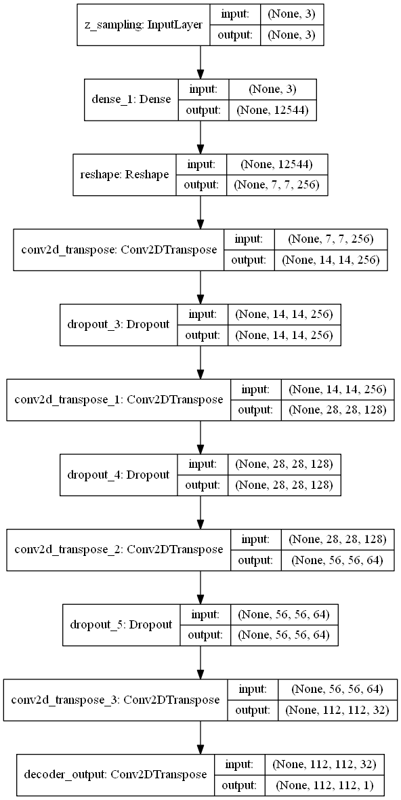

---

### Used dataset
idx | Font | sample images
------------ | ------------ | -------------
0 | EBGaramond |  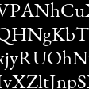 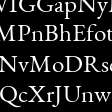 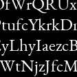 
1 | PT_Serif | 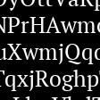 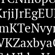 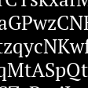 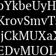 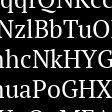
2 | NotoSans | 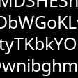 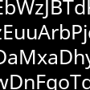 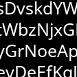 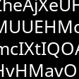 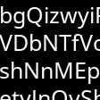
3 | Roboto | 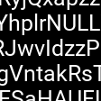 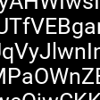  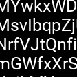 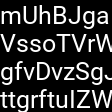
4 | Righteous | 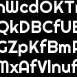 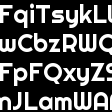 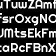 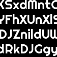 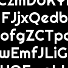
5 | Bangers | 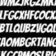 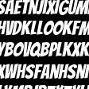 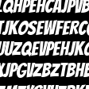 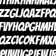 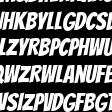
6 | Pacifico | 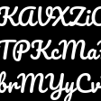 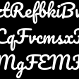 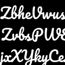 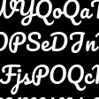 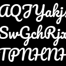
7 | DancingScript | 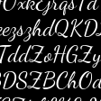 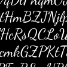  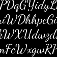 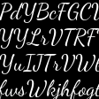
8 | Inconsolata | 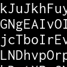 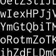 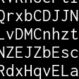 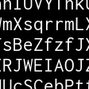 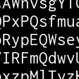
9 | VT323 | 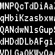 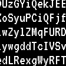 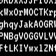 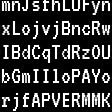 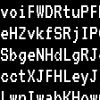

---

### Trainging history w/ 20 epochs
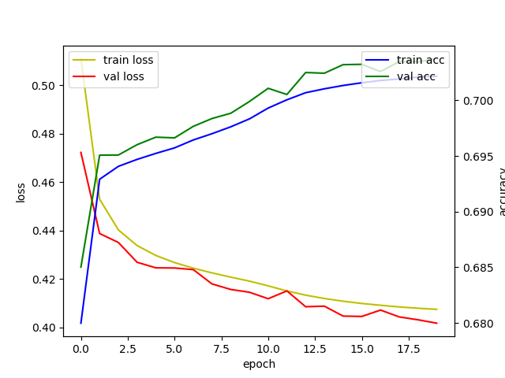

---

### 2 Dimensional latent space
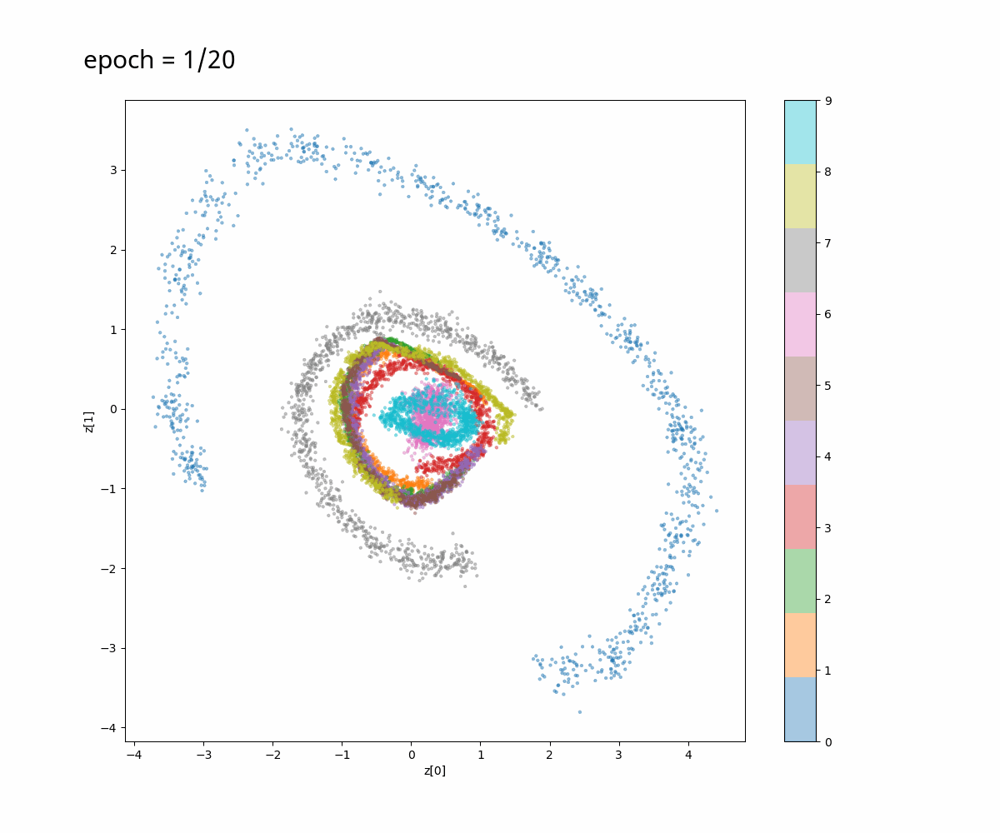

---

#### References: 
[1] Kingma, Diederik P., and Max Welling. "Auto-encoding variational bayes. "https://arxiv.org/abs/1312.6114  
[2] https://blog.keras.io/building-autoencoders-in-keras.html  
[3] https://github.com/keras-team/keras/blob/master/examples/variational_autoencoder_deconv.py

#### Dataset: 
- https://fonts.google.com/

