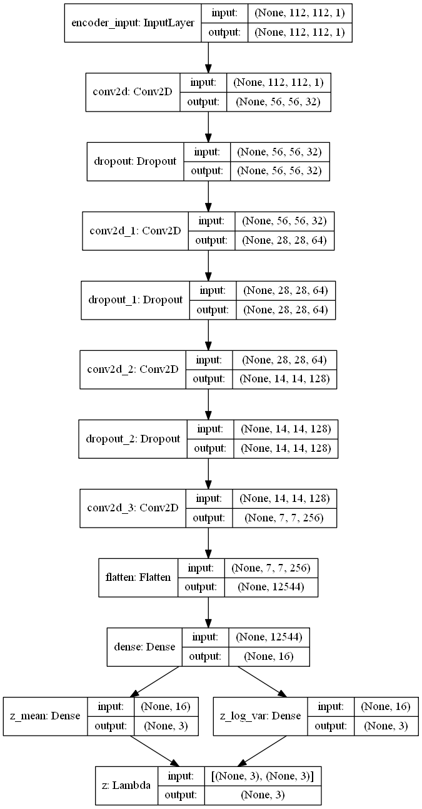
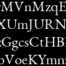
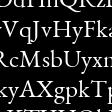
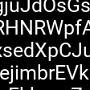
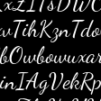

# Analysis of font shape   using Variational Autoencoder with Convnets

---

### VAE architecture

The VAE has a modular design. The encoder, decoder and VAE are 3 models that share weights. After training the VAE model, the encoder can be used to generate latent vectors. The decoder can be used to generate font images by sampling the latent vector from a Gaussian distribution with mean=0 and std=1.

encoder | decoder
------------ | -------------
 | 

---

### Used dataset
dataset size = train 5000 & validation 1000 per each class 
width, height = 112, 112 
font size = 25 
used characters = "AaBbCcDdEeFfGgHhIiJjKkLlMmNnOoPpQqRrSsTtUuVvWwXxYyZz" 

idx | font name | sample images
------------ | ------------ | -------------
0 | EBGaramond |     
1 | PT_Serif |     
2 | NotoSans |     
3 | Roboto |     
4 | Righteous |     
5 | Bangers |     
6 | Pacifico |     
7 | DancingScript |     
8 | Inconsolata |     
9 | VT323 |     

---

### Trainging history 

w/ 20 epochs

---

### 2 dimensional latent space 

---

#### References:

[1] [Kingma, Diederik P., and Max Welling. "Auto-encoding variational bayes."](https://arxiv.org/abs/1312.6114)  
[2] [Keras Blog: Building Autoencoders in Keras](https://blog.keras.io/building-autoencoders-in-keras.html)  
[3] [Keras example: VAE](https://github.com/keras-team/keras/blob/master/examples/variational_autoencoder_deconv.py)

#### Dataset:

- https://fonts.google.com/

